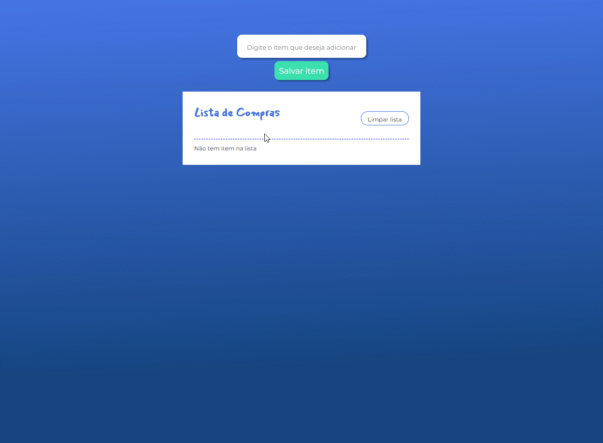

# Aplicação de Lista de compras

;

## Instalação de dependências

- `npm i`

## Execusão do projeto

- `ng serve --o`

# Ciclo de vida no Angular

- Tudo começa quando o Angular instancia a classe do componente, ou seja, quando ele chama a classe do componente e o exibe na tela. A vida dele acontece quando o Angular mostra os itens, interage com a pessoa usuária e interage com outros componentes. Por fim ele é destruído quando o componente ou diretiva não é mais utilizada, então o Angular destrói a instância dessa classe.

- O Angular chama algum método no decorrer da vida dele, ou seja, em cada um desses momentos. Esses métodos são chamados de hooks (tradução: ganchos).

## ngOnInit()

- O OnInit é o lugar para criar lógicas adicionais logo após o componente/diretiva ser inicializado e antes de qualquer exibição ou componentes filhos serem verificados.
- Um exemplo de lógica de inicialização é a de realizar uma busca em um método de um serviço. Importante ressaltar que este gancho é chamado apenas uma vez.

## ngOnChanges()

- O Angular utiliza um mecanismo de detecção de mudança que identifica quando um componente tem uma propriedade de entrada.
- oOAngular precisa preparar as informações para serem renderizaradas. Depois de renderizadas, ele conseguirá trazê-las para a tela, chamando o OnInit.
- Em resumo: primeiro temos o OnChanges para preparar as informações, depois temos o OnInit para trazer as informações para a tela, mostrando nosso componente.
- O OnChanges é o primeiro gancho a ser chamado, mas somente quando o componente/diretiva possui propriedades de entrada de dados.
- O que difere o OnInit do OnChanges é que o OnInit é chamado somente uma vez durante toda vida do componente/diretiva, já o OnChanges é chamado sempre que houver mudança nas propriedades de entrada de dados.

## ngDoCheck()

- O DoCheck detecta tudo que o OnChange não consegue detectar, como quando uma propriedade é alterada ou quando um método é chamado de dentro desse componente. A única desvantagem do DoCheck é a quantidade de vezes que ele é invocado. Por exemplo, ao digitar no campo de texto da aplicação, vamos reparar que ele é chamado a cada caractere inserido ou removido.

- Além disso, o DoCheck detecta alterações de componentes-filhos. Ou seja, o AppComponent está escutando todas as alterações dos componentes-filhos. Logo, ele pode ser utilizado para realizar verificações de propriedades em componentes.

- É importante usar o DoCheck com cuidado por conta do número de vezes que ele é chamado, pois é possível ter perda de performance na aplicação. O DoCheck é um gancho que é chamado sempre que houver qualquer alteração no componente.
